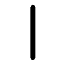
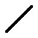
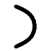
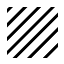

= ЧПУшка GUI User Manual
:toc: left
:toclevels: 3
:numbered:
:author: Панин Денис ИВТ-42

== О программе

Программа *ЧПУшка GUI* предоставляет пользователю дружелюбный интерфейс и бэкенд для взаимодействия с Ч4П2У посредством интерфейса UART.

== Установка

=== Требования

Требования к оборудованию:

* IBM-PC совместмый PC

Требования к установленному ПО:

* `Python 3.13.7`

Требования к установленным пакетам python:

* `PyQt5 5.15.11`
* `pillow 11.2.1`
* `pyserial 3.5`

=== Инструкция по установке

1. Переместитесь в директорию для установки
2. Выполните `git clone https://github.com/BIG-Denis/cnc-software.git`
3. Выполните `cd cnc-foftware/gui`
4. Выполните `python main.py` для запуска программы

[NOTE]
Точка входа - файл `main.py`, вы можете самостоятельно сделать на него ярлык для более удобного запуска.

=== Исходный код

Репозиторий проекта: https://github.com/BIG-Denis/cnc-software[software-cnc]

== Использование

В данном разделе описано использование программы со стороны пользователя, без технических деталей.

=== Первичная настройка

При включении программы будет открыто меню настройки.

Выберите нужный COM-порт, посредством которого осуществялется подключение ПК к ЧПУ через интерфейс UART.

Введите baud-rate соответсвующий настройкам ЧПУ.

Чтобы обновить список доступных COM-портов используйте кнопку *обновить*.

Чтобы проверить соединение используйте кнопку *проверить соединение*.

[NOTE]
Кнопка *проверить соединение* отправляет телеметрический запрос версии провишки ЧПУ.

После успешной настройки и проверки соединения можно переходить к пункту *рисование*.

[IMPORTANT]
Кнопка *выгрузить G-коды для текущего ресунка* используется для отладки и позволяет выгрузить все отправленные раннее G-коды, соответствующие рисунке на вкладке *рисование*. Они могут быть загружены в симулятор G-кодов для проверки корректности нарисованного изображения. G-коды будут выгружены в файл `g_codes_dump.cnc`, если такой файл уже существует всплывет окно с подтверждением.

=== Рисование

==== Фундамент

Рисование всех фигур (кроме штриховки) происходит *только* между текущим положением картеки и точкой клика.

Текущее положение каретки отмечено жирной красной точкой.

При каждом рисовании на концах фигуры ставятся якорные точки (точки привязки).

После клика рисуется предпросмотр нарисованной фигуры и появляется окно с подтверждением. Всё, что уже нарисовано - черное. Предпросмотр рисования - зеленый. Предпросмотр перемещения - оранжевый.

Выбранный режим рисования выделяется жирной обводкой соответствующей кнопки.

==== Фигуры

===== Вертикальная линия

.кнопка вертикальной линии

Вертикальная линия рисуется строго вертикально. Даже если нажать конечную точку не выровняв мышь по оси y, это произойдет автоматически.

Можно использовать с опущенным флагом рисования для перемещния каретки по вертикали.

===== Горизонатальная линия

.кнопка горизонтальной линии
image::icons/hrz.png[width=auto]

Позволяет рисовать линию в произвольную точку поля.

Можно использовать с опущенным флагом рисования для перемещния каретки в любую точку.

===== Произвольная линия

.кнопка произвольной линии

Горизонтальная линия рисуется строго горизонтально. Даже если нажать конечную точку не выровняв мышь по оси x, это произойдет автоматически.

Можно использовать с опущенным флагом рисования для перемещния каретки по горизонтали.

===== Дуга

.кнопка дуги

Дуга рисуется между двумя точками, используя значения полей *радиус окружности* и *дуга против часовой стрелки*.

Первая точка - текущее положение каретки. Вторая точка - точка клика.

Поле *радиус окружности* определяет радиус нарисованной окружности. В случае, если математически построить дугу между двумя точками невозможно (диаметр меньше расстояния между точками) на экране появится соответствующее предупреждение и команда не будет выполнена.

Флажок *дуга против часовой стрелки* используется для указания направления рисования. Если флажок опущен, дуга между двумя точками рисуется по часовой стрелке.
Если флажок поднят, то против часовой стрелки.

[IMPORTANT]
По умолчанию рисуется наименьшая дуга (<180 градусов), чтобы нарисовать наибольшую дугу используйте равное по модулю, но противоположное по знакому значение радиуса.

[NOTE]
Математически, между двумя точками с заданным радиусом можно нарисовать дугу четырьмя способами.
Все 4 способа могут быть нарисованы используя комбинации полей положительного/отрицательного радиуса и рисования по/против часовой стрелки.

===== Штриховка

.кнопка штриховки

Штриховка заштриховывает любой замкнутый уже нарисованными фигурами контур, используя значения полей *угол штриховки* и *расстояние между линиями*.

==== Дополнительные кнопки

===== Рисование

Флажок *рисование* используется для выбора режима рисование/перемещение. Если влажок снят, то каретка переместится в точку клика. Если влажок поднят, то каретка нарисует соответствующую фигуру между текущей позицией и точкой клика.

===== Привязка

Флажок *привязка* используется для привязки к ближайшей якорной точке. Результат аналогичен тому, что вы бы точно кликнули на ближайшую якорную точку.

[IMPORTANT]
Не рекомендуется использовать с инструментом *штриховка*, т.к. полученный результат может не соответствовать желаемому.

===== Поставить якорную точку на текущей позиции

Устанавливает якорную точку в текущем местоположении каретки.

===== Очистить картинку

Очищает картинку и соответствующий ему список G-кодов (использующийся для дампа).

[IMPORTANT]
Вместе с очисткой картинки рекомендуется заменить поле на ЧПУ, чтобы картинки не накладывались.

===== Калибровка

Перемещает картеку на нулевые координаты.

[IMPORTANT]
Рекомендуется периодически выполнять калибровку, чтобы минимизировать влияние погрешностей.

==== Чтение из файла

Внизу вкладки представлена кнопка *выбрать файл*, позволяющая указать путь к файлу с G-кодами.

После выбора файла путь к нему отобразится на экране.

После нажатия кнопки *отправить* файл с G-кодами будет целиком отправлен на ЧПУ.

=== Режим отладки

Режим отладки используется для отладки и релазизует следующий функционал.

Введите G-код в формате текста и нажмите кнопку *отправить* для отправки одиночного G-кода.
Может использоваться для тестирования поддержки новых G-кодов, которые еще не были добавлены в GUI.

Введите целый пакет в HEX формате текстом и нажмите кнопку *отправить* для отправки одиночного пакета данных на ЧПУ.
Может использоваться для проверки функционала ЧПУ по обработке некорректных пакетов или запроса телеметрии неподдерживаемой GUI.

== Техническое исполнение

В режиме рисования после подтверждения пакет с G-кодом соответствующим новому инкременту на рисунке будет отправлен на ЧПУ. Управление будет заблокировано и на экране не отрисуется новая фигура до момента пока ЧПУ не отправит сигнал об успешном выполнении команды, в противном случае рисунок не появится.
